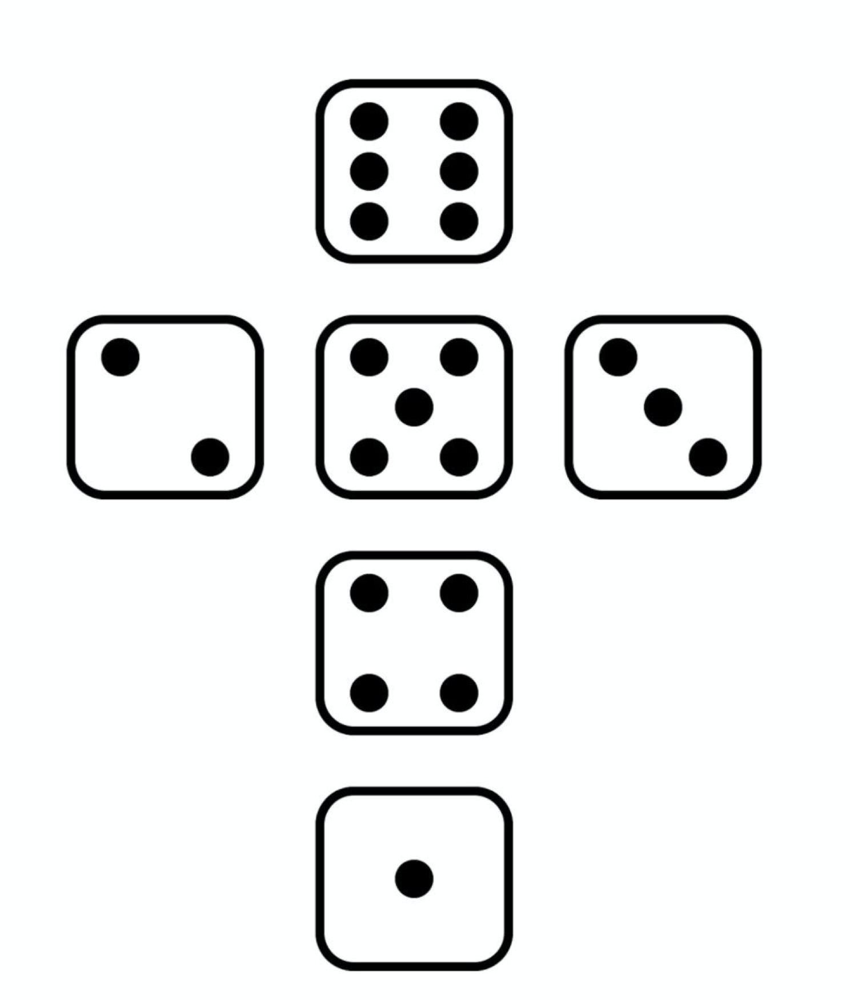
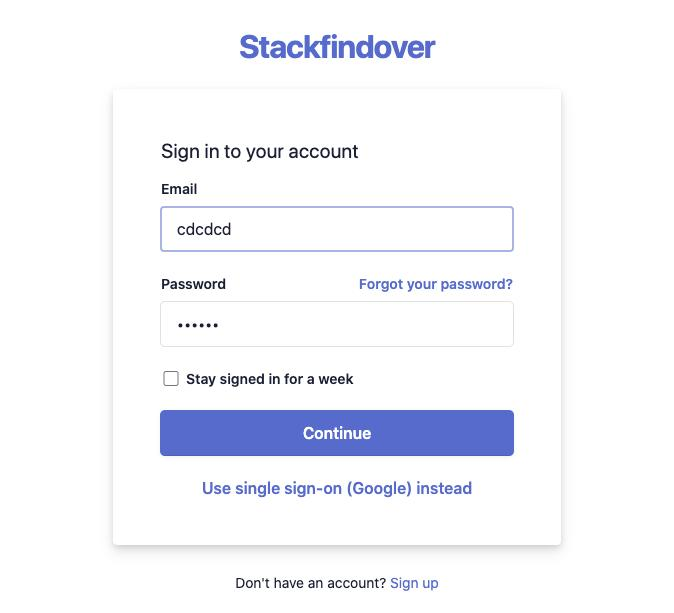

# eKreative
JS test task for lektorium by eKreative.

## Завдання 1
Намалювати фігуру. [GitHub Page](https://andriistoliarov.github.io/testTasks/eKreative/1/index.html).

**Вимоги:**
- Не використовувати картинок
- html/css (flexbox)
- Точки центрувати з допомогою flexbox
- Адаптивний дизайн не потрібний

## Завдання 2
Зробити форму логіну (тільки дизайн). [GitHub Page](https://andriistoliarov.github.io/testTasks/eKreative/2/index.html).

**Вимоги:**
- Не використовувати зображень
- Форма повинна бути відцентрована посередині сторінки
- Коли ти наводиш на поле вводу, checkbox, кнопку, 
чи силки (“forgot your password?”, “Use single-on...”, “Sign up”)
повинен показувати палець (cursor: pointer)
- “Forgot your password” - силка яка веде на google.com
- “Use single-on…” - силка яка веде на google maps
- “Sign up” - силка яка веде на facebook
- Шрифти на вибір
- Кольори повинні бути приблизно схожі
- Розміри відносно екрану приблизно
